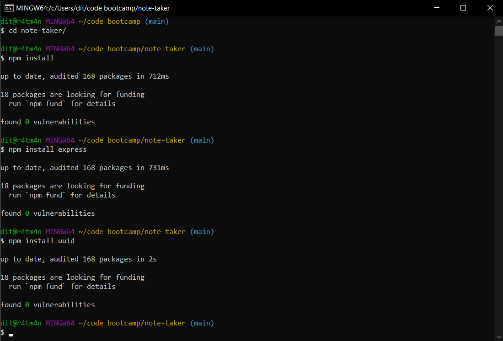

# Note Taker 

>> - Heroku Deployment URL: https://dita-note-taker.herokuapp.com/
>> - Project Repository URL: https://github.com/ditazan/note-taker

## Description 

Note Taker is an application that can be used to write and save notes. This application uses an Express.js back end that saves and retrieve note data from a JSON file.

## Languages and Libraries Utilized

> * Javascript
> * HTML5
> * CSS
> * Node.js
> * NPM
> * Express
> * Express Router
> * UUID

## Installation
> 1. Clone the repository located at: https://github.com/ditazan/note-taker
> 2. Install Node.js. Latest version is available at https://nodejs.org/en/ ;
> 3. Open the project in your terminal and install NPM ( simply type "**npm install**" and press enter.) 
> 4. Then install Express ( "**npm install express**" and press enter. )
> 5. Lastly you will need to install UUID ( "**npm install uuid**" and press enter.)

## How To Use
Do Deploy the Project locally you must start the Express server. In the terminal with the project directory open, type "**npm start**" and press enter.

Now that the Express server is started, you may open your web browser and go to the URL: http://localhost:3001.

Once the page has loaded, you may press the Get Started button, where you will be prompted with the note taking page. On this page you can create new notes, save notes, and even delete notes you no longer need.
